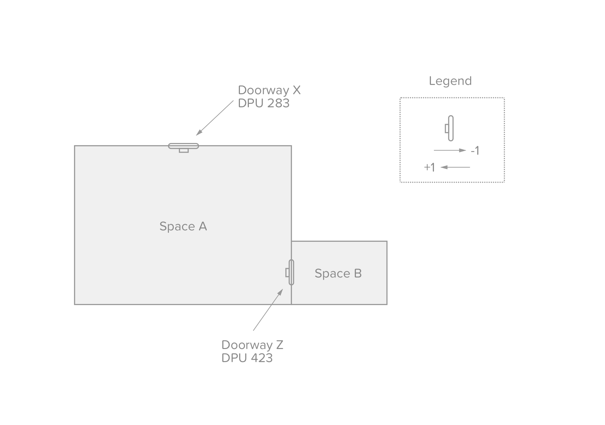
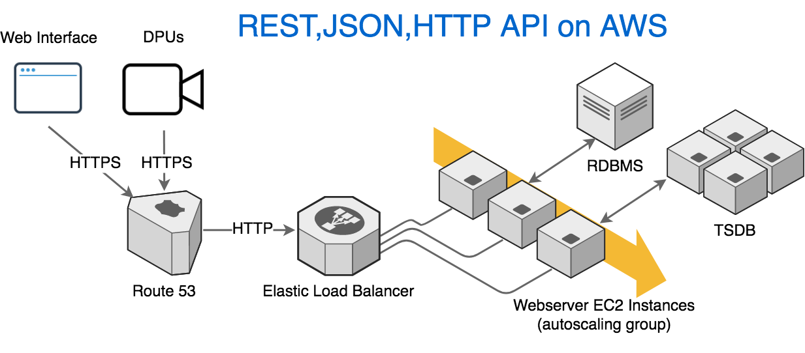
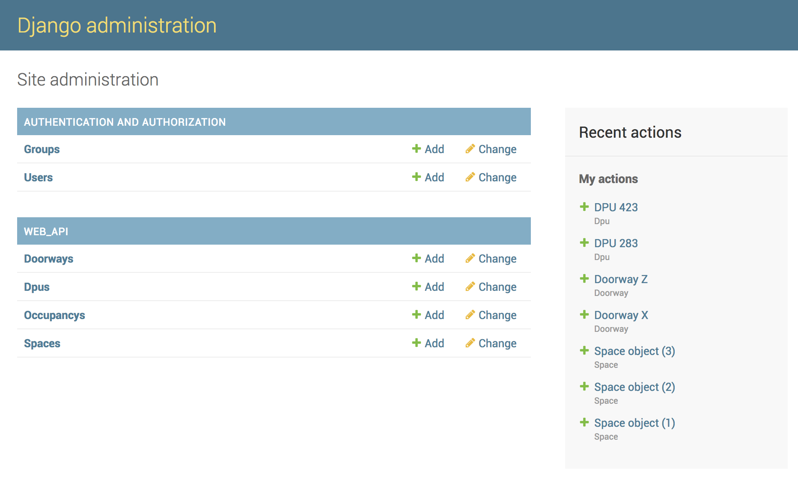
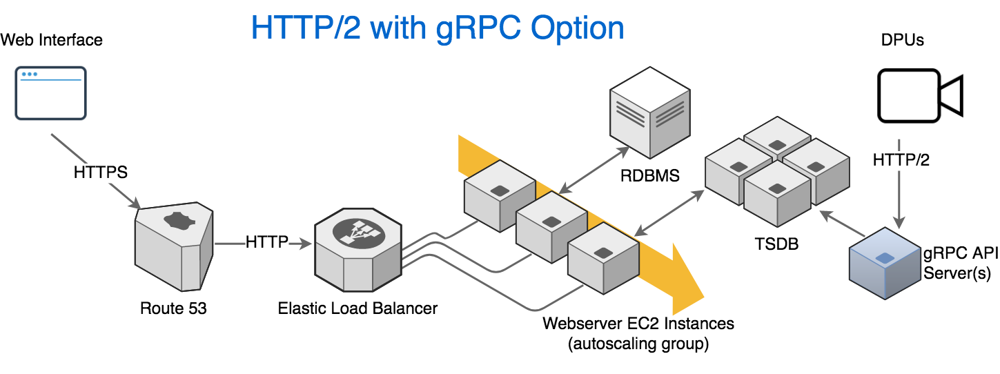

### Purpose

In this document I will analyze the software requirements and implement a proof of concept for a system that can track room occupancy over time using hardware motion sensors.

My goal is to create an API that can handle both historical and real-time people count requests from clients using a data model that is clear and concise. I will also identify potential bottlenecks and offer solutions to scale up such a system in production while also remaining highly available, durable, and easy to administrate.


### Definitions and Example

> *Which is a kind of integrity, if you look on every exit as being an entrance somewhere else.* – Tom Stoppard


To create and store the layout of a building we need to define both spaces and doorways. You can think of the spaces as nodes and the doorways as edges of a graph.

The devices we want to work with are DPUs (depth processing units) and can be mounted above doorways. The DPU sends a request to the API when a person passes underneath (+1 when towards the DPU, -1 when walking away from the DPU).

Here is an illustration of a very simple room layout with two spaces, doorways, and DPUs:



You'll notice that there's a third implied space: outside. For the sake of completeness, we will always include an "outside" space in the data model so that all doorways, even those leading outside of a building, will have connected spaces on both sides.

Doorways will also need to have a "direction" -- that is to say they are a portal *leaving from* one space and *going to* another. The DPUs are mounted over doorways and peer into a space. That is the space that the doorway is *going to*. When someone walks beneath a sensor and it records them walking away from it, they are entering the space that the doorway leads to and a "+1" signal is sent.

In the data model for a doorway, I use the terms `entering_to` and `exiting_to` to specify which spaces the doorway's DPU will point into and which one is behind it (not directly observed), respectively.


### System Architecture

For the proof-of-concept, I will create a very basic Django app that shows what an API would look like to serve this purpose. Relying on a RESTful API that exchanges JSON makes for very rapid prototyping and can get you to the point of tinkering around with hundreds of devices no problem. Here is a sketch of the architecture if deployed to AWS (just to illustrate; the choice of hosting is outside the scope of this project).




HTTP requests are sent from DPUs to POST their observations. If there is any connection issue, they will hold onto as many records as they can and transmit them when a connection can be reestablished. This means that the data may arrive delayed, out of order, and possibly in bulk. The web interface for end-users and system administrators uses the same entry point and hits the same load-balanced servers. For the proof of concept, I used Django, which is suited for both answering web requests (rendering templates) and API requests from DPUs. A JS framework on the frontend (i.e. requesting data for charts) would fit right in as well.

The webservers handling API requests would push DPU updates to a time series database (TSDB). This can be just about any TSDB on the market, as our use case is very simple. In the proof of concept, I will just use a table in the RDBMS to keep things simple, but this would be inefficient in production. In the *Production Stack and Scaling* section below I will discuss better solutions like Redis, InfluxDB, and ElasticSearch. The determining factors for choosing this critical part of the tech stack are:

- ability to handle a write-heavy workload on modest hardware with aplomb
- must offer fast time-boxed queries including aggregations
- durable; should write to disk on at least one node before a transaction is "successful" and recover from errors/crashes gracefully
- highly available with flexible cluster shape/size, allowing writes to be segmented among several nodes
- great support for data retention levels and granularity ("rolling up" older data)


### Data Model

As mentioned above, the three core elements we need to model are spaces, doorways, and DPUs. We'll also need a place to store timeseries data since the proof of concept doesn't have a separate TSDB solution. In the Django settings included in this repo, I've gone with the default `sqlite` for the database; this is only for demonstration and should *never* be used in production.

[Here is a Django model that implements this data model](web_api/web_api/models.py). The included docstrings show my thought process on the subtle points and relationships between the tables.

[Here is an SQL file that will create a matching schema](web_api/init.sql) and add the default "outside" space.


### Storage and Retrieval

Ideally, we would use a traditional RDBMS to store all of our relational data like customer information, the room layouts, and useful nicknames for all of our things while storing the time series data of occupancy counts with timestamps in a dedicated TSDB. Recommendations and considerations for this setup is explored in the last section below, *Production Stack and Scaling*.

For the purposes of this proof of concept, I will store everything in sqlite. This is slow and shouldn't be used to benchmark performance in any meaningful way. It does illustrate, however, that we can build a very straightforward API to do CRUD on the entities and enter DPU data.

I added indexes on the time series table, `Occupancy`, that might need to be extended to a compound index depending on the DB that is chosen -- be sure to check your query plans (i.e. `EXPLAIN QUERY PLAN`) to be sure it's using indexes for every operation on this table or it will become very slow when millions of rows are added! This is one of the reasons moving to a dedicated TSDB makes sense in the long run.

I don't have time to set up a neat interface to consume the charts and graphs possible with the time series data. I also don't have time to create an admin interface but I chose to use Django for the example project and activated its built-in Admin site, which is handy for adding our initial data (see illustration above for what's included in the database). If you stand up the local dev server by running `python web_api/manage.py runserver `, you can navigate to `http://localhost:8000/admin` and enter the credentials `admin/securepassword` to log in (or use the `createsuperuser` command to add a new user).




There are two basic queries that we'll want to perform: current occupant count for a given space and a historical occupant count of a space at a given time in the past. I've made these into a single endpoint at `/space/<ID>/count`. An optional GET arg `timestamp` can specify the date and time in question if you want a historical reading or just leave it off for the current occupancy count.

Down the road, we would probably extend this to offer timeranges that would return the timeseries data for the range suitable for charting and stats (like daily peak count and averages). This would allow us to create super cool dashboards and alerting systems.

The code that process API queries is located [here in `views.py`](web_api/web_api/views.py).


### Proof of Concept

#### Loading Example Data

To emulate DPUs and backfill some test data, I wrote a simple Python script that reads data from a CSV and POSTs it via API. That script is located [here](load_csv.py) and a test CSV is provided [here](dpu_data.csv), both in the top-level directory of this repo. It's safe to re-run the script if data is already inserted, as it ignores `409 Conflict` responses.


#### Server & Sample Queries

I've already run migrations and loaded data into the sqlite DB included in this repo, so if you want to run the local API server, simply install Python3 and use pip to install Django, starting a virtualenv first as you see fit. There are no extra dependencies, so `python web_api/manage.py runserver` should start a test server that you can query against.

Example of getting the current count for Space A (id 2) using cURL to make a GET request:

```bash
$ curl 'http://127.0.0.1:8000/space/2/count/'
{"space_id": 2, "count": 4}
```

And to get the occupancy at a certain time:

```bash
$ curl 'http://127.0.0.1:8000/space/2/count/?timestamp=2018-02-26T16:08:02.170Z'
{"space_id": 2, "count": 3}
```

The distant past and future work as expected, with zeros in the past and the current occupancy maintained until updated by a DPU:

```bash
$ curl 'http://127.0.0.1:8000/space/2/count/?timestamp=1984-01-01'
{"space_id": 3, "count": 0}
$ curl 'http://127.0.0.1:8000/space/2/count/?timestamp=2525-01-01'
{"space_id": 3, "count": 4}
```


### Complications and Considerations

This simple data model of spaces connected via doorways doesn't have any validation on it so it's possible to create really weird scenarios like a room that enters into itself and can't accumulate occupants.

I assume all rooms start at zero occupants. I don't allow the counts to go below zero, so the counts will only be accurate after a DPU is installed and room has become empty once.

I have not considered security or even basic authentication of the incoming data, just its in-flight security via TLS. We would want to think of how to authenticate DPUs when they are added and how to validate incoming requests from them.

Observability is paramount and I didn't discuss how to watch all of these systems to make sure they're healthy. We would want centralized logging and alerting at the very least plus APM to keep an eye out for unexpectedly low amounts of data coming from DPUs.

I also did not consider API versioning. The common methods are handled nicely by most frameworks including DRF, so it would be down to picking whatever is easiest to maintain over time on the hardware side:

- [Accept-Header](http://www.django-rest-framework.org/api-guide/versioning/#acceptheaderversioning) (probably my favorite for this purpose since we don't need lots of third parties integrating)
- [URL Path](http://www.django-rest-framework.org/api-guide/versioning/#urlpathversioning)
- [Namespace](http://www.django-rest-framework.org/api-guide/versioning/#namespaceversioning)
- [Hostname](http://www.django-rest-framework.org/api-guide/versioning/#hostnameversioning)
- [Query Parameter](http://www.django-rest-framework.org/api-guide/versioning/#queryparameterversioning)

The data model includes some assertions that will be hard to escape, so future hardware might need a lot of work to play nicely with this data model. For example, what if we had sensors allowed on both sides of a doorway or one within a room that just recorded activity? We would need new endpoints for spaces and a time series datastore of activity metrics.

Finally, I did not include any streams. It makes sense to have a streaming connection for realtime data being displayed to a dashboard, so maybe a websocket would be ideal there versus repeating requests at intervals. The same goes for busy intersections where DPUs are funneling lots of data to the backend; why not keep that connection alive via websockets or another streaming connection type. HTTP/2+gRPC is discussed below but other solutions could also fit nicely like MQTT, although it may be too complicated for this use case with its myriad queuing options.


### Production Stack and Scaling

Each system within the proposed architecture can scale independently. We can add more webservers to handle requests, grow the cluster that stores timeseries data, partition writes across several servers, etc.

If you were to keep using the traditional RDBMS as storage for the time series data (records of room occupancy numbers with timestamps), then you would want to partition that data at some point so writes are fanned out to multiple servers. However, this is a really obvious use case for a TSDB, so make life easier and use one!

I think this production stack will scale to the point of millions of requests per minute (RPM) from the DPUs and hundreds of RPM from dashboards and web users:

* The RDBMS can be anything that allows for easy sharding and replication with a long history of solid performance. PostgreSQL would be my go-to in this case but MariaDB is a close second.
* The TSDB can be anything that meets the qualifications in the *System Architecture* section above. The best performer that meets the criteria while also providing a bunch of great tools to examine the data is going to be either ElasticSearch (ELK stack) or InfluxData (TICK stack). I also discuss below the merits of building a custom TSDB.
* For handling web/API requests, use whatever is most familiar. Django with Python is a great choice and I've seen it scale to serve millions of customers while remaining easy to maintain. Separating out microservices might also make sense once bottlenecks make themselves known.
* For hosting, it's easiest to get going and scale up with a cloud platform like AWS or GCP. Please don't use Rackspace or start on bare metal; move to those later on if you must.


Choosing how/where to store the time series data may be difficult because you're not sure what else you'll want to store later and what queries you might find important to run often. Redis (on hosted services like ElastiCache or not) only have eventual consistency and durability, so they are probably not suitable for this application. The suggestions above for the Influx stack (TICK) or ElasticSearch (ELK) are solid and easy to configure/scale over time, with as many nodes as needed for availability and replication. However, I would carefully consider building your own solution as well. A service (perhaps in Go) using a tight binary protocol like gRPC or Cap'n Proto could handle the incoming requests from the DPUs very well. They could use an AOF for durability and have a worker that batch-forwards inserts into the TSDB with the new data. For in-memory timeseries, Facebook's Gorilla project ([example implementation here](https://github.com/facebookincubator/beringei)) offers a succinct way of storing and accessing the data.




This would break up the load, allowing the DPUs to communicate to a pool of specialized, fast services using a small binary protocol like gRPC or MQTT with streaming for bulk updates.


### 

